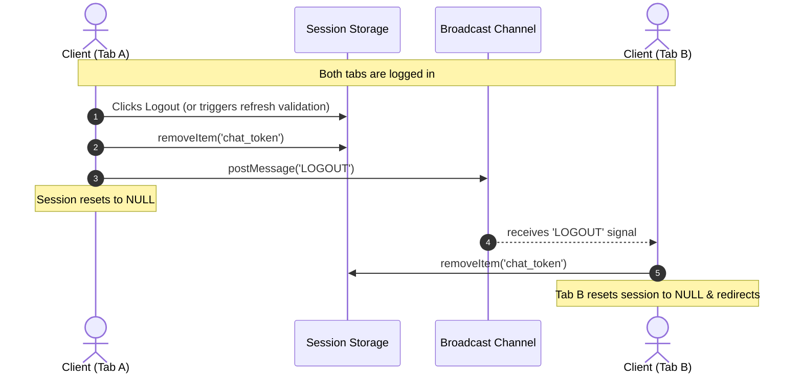
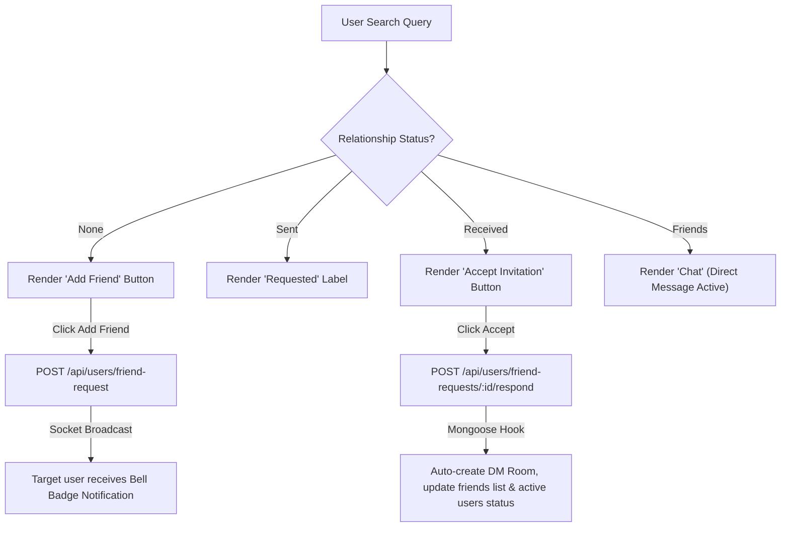
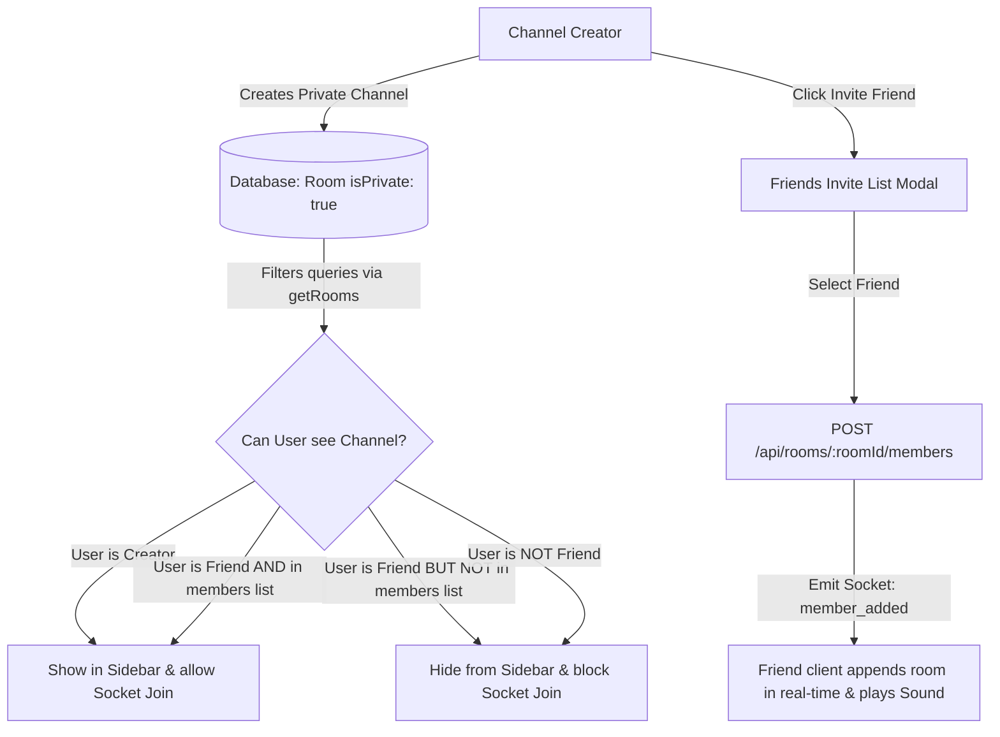
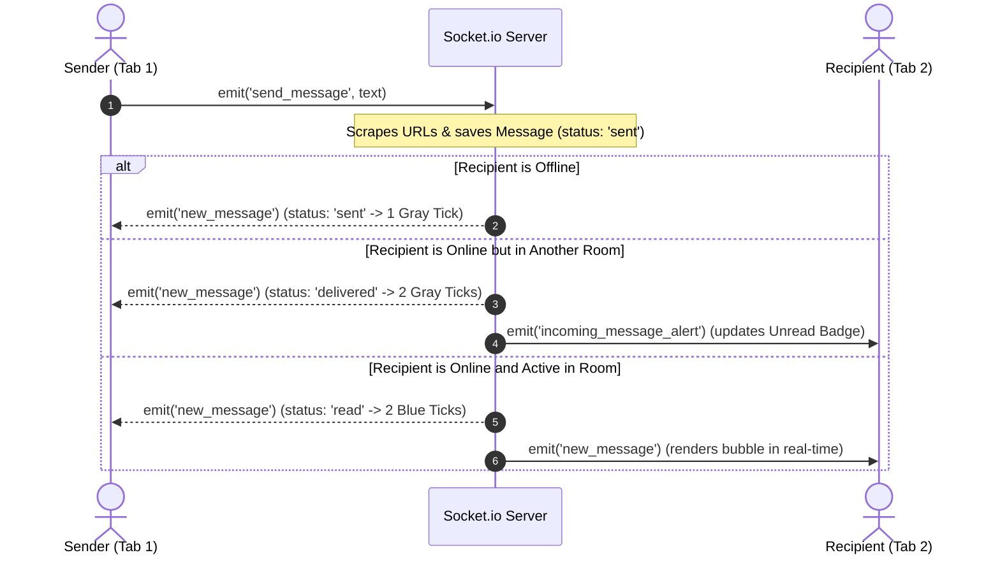

# 🌐 DevConnect — Premium Collaborative Workspace Chat Application

**DevConnect** is a premium, high-fidelity real-time MERN (MongoDB, Express, React, Node.js) collaborative workspace chat application. Styled with a modern, high-contrast, flat black-and-white aesthetic inspired by the **X (formerly Twitter) branding**, the workspace operates on a zero-gradient layout supporting direct messaging, privacy-guarded group channels, mutual connection pipelines, real-time presence indicators, interactive emoji reactions, and rich content scraping.

---

## 🧭 Application Workflows & System Architecture

### 1. Cross-Tab Session Synchronization & Auto-Logout
To secure user workspace contexts, the application validates tokens on window mount/reload. It utilizes a `BroadcastChannel` to automatically broadcast logout signals to all other active tabs when a session is cleared.



### 2. Mutual Connection & Direct Messaging Flow
Direct Messaging (DM) channels are locked by default. Search results classify relationship states dynamically. Direct messaging is only initialized when two users become mutual friends.



### 3. Private Channel & Creator Gatekeeping
Group channels support Public and Private privacy toggles. Private channels utilize a two-tier permission model: friendship acts as a gatekeeper, while creator invitations grant membership.



### 4. Real-Time Message Delivery Lifecycle (Ticks)
Outgoing chat bubbles render real-time WhatsApp-style delivery tick feedback (Sent, Delivered, Read).



---

## 🌟 Premium Features List

### 1. Interactive Emoji Reactions
Users can hover over any message bubble (incoming or outgoing) to toggle a floating emoji bar. Clicking an emoji registers a reaction. Outgoing reaction counts are grouped, and users can toggle reactions off.

### 2. Rich Markdown & Syntax Highlighting
Messages support rendering markdown structures natively:
* Inline code blocks defined with backticks (e.g. `` `code` ``) are rendered with sharp monospaced styling.
* Code blocks defined with triple backticks (e.g. ` ```javascript `) render in a flat syntax container showing language headers.

### 3. Automatic Link Previews
When a user sends a URL in a message:
* The backend scrapes the target site's metadata tags (`og:title`, `og:description`, `og:image`).
* It automatically appends preview parameters to the message, rendering a link card with custom hover states inside the chat feed.

### 4. Web Audio Synthesized Sounds
DevConnect features high-fidelity native sound notifications synthesized using the browser's Web Audio API:
* **Sent tone**: High-frequency rising beep.
* **Received tone**: Two-step chime.
* A global mute/unmute speaker toggle is placed in the sidebar header to easily silence alerts.

### 5. High-Contrast X Styles & Themes
Default workspace styles feature a dark mode theme matching X's dashboard. A theme toggle is provided in the Settings page, allowing users to swap to a high-contrast Light Mode.

---

## 🛠️ Color-Coded Layout Guidelines

We use standardized color codes to explain states and functionalities across the MERN backend and React client:

> [!NOTE]
> <span style="color:#1d9bf0">**X Blue Theme color (`#1d9bf0`)**</span>: Represents the active workspace actions, selected tab headers, focus outlines on input controls, and the sky-blue double-tick for read messages.

> [!IMPORTANT]
> <span style="color:#ffffff; background:#16181c; padding:2px 6px; border-radius:4px">**Dark Card Theme color (`#16181c`)**</span>: Used for general incoming chat bubble backdrops, active settings layout containers, and search popups. Keep typography contrast high (`#e7e9ea`).

> [!TIP]
> <span style="color:#00ba7c">**Success Green Theme color (`#00ba7c`)**</span>: Represents active user status indicators ("online"), completed steps, accepted friend invitations, and strong passwords.

> [!WARNING]
> <span style="color:#ffd600">**Warning Yellow Theme color (`#ffd600`)**</span>: Used for medium password strength warnings and pending incoming invitations indicators.

> [!CAUTION]
> <span style="color:#f4212e">**Danger Red Theme color (`#f4212e`)**</span>: Represents deleting channels, kicking members, removing friends, weak password validations, and the logout confirmation button.

---

## 📂 Project Directory Structure

```text
2_Basic-Chat-Application/
├── backend/
│   ├── src/
│   │   ├── config/       # MongoDB Database configuration
│   │   ├── controllers/  # Auth, Room, Message, and Friend Controllers
│   │   ├── middleware/   # Protected JWT authentication routes
│   │   ├── models/       # Mongoose Schemas (User, Room, Message, FriendRequest)
│   │   ├── routes/       # Express Route endpoints
│   │   ├── sockets/      # Socket.io connection and event handlers
│   │   └── server.js     # Entry point
│   ├── .env              # Environment configurations
│   └── package.json
├── frontend/
│   ├── src/
│   │   ├── assets/       # Static audio and image files
│   │   ├── components/   # UI (AuthPage, ChatDashboard, MessageBubble)
│   │   ├── context/      # Context APIs (AuthContext, SocketContext)
│   │   ├── App.jsx       # View gatekeeper and centered loader container
│   │   ├── index.css     # Responsive X-themed stylesheet
│   │   └── main.jsx
│   ├── index.html
│   ├── vite.config.js
│   └── package.json
└── README.md             # This documentation file
```

---

## 🚀 Getting Started

### 1. Database & Server Setup (Backend)
1. Navigate to the `backend` directory:
   ```bash
   cd backend
   ```
2. Install all required dependencies:
   ```bash
   npm install
   ```
3. Create a `.env` file in the `backend/` directory:
   ```env
   PORT=5000
   MONGODB_URI=mongodb+localhost:27017/devconnect
   JWT_SECRET=supersecretchatkey123!
   ```
4. Start the server in development mode:
   ```bash
   npm run dev
   ```
   *The server runs on [http://localhost:5000](http://localhost:5000).*

### 2. Client Setup (Frontend)
1. Navigate to the `frontend` directory:
   ```bash
   cd frontend
   ```
2. Install packages:
   ```bash
   npm install
   ```
3. Create a `.env` file in the `frontend/` directory:
   ```env
   VITE_API_URL=http://localhost:5000/api
   ```
4. Start the Vite development server:
   ```bash
   npm run dev
   ```
   *The client runs on [http://localhost:5173](http://localhost:5173).*

---

## 🧪 Operational & Testing Playbook

Follow this step-by-step checklist to test the application's real-time features:

### 1. Verification of Password Strength and Auth Validation
1. Open the signup page on the frontend.
2. Type a short password. Notice the dynamic gauge label: <span style="color:#f4212e">**Weak**</span>.
3. Type a mix of symbols, numbers, and uppercase characters. Notice it upgrades to <span style="color:#ffd600">**Medium**</span> or <span style="color:#00ba7c">**Strong**</span>.
4. Type a mismatched password in the "Confirm Password" box. Verify the red matching error is displayed. Type matching strings to verify the green match indicator.

### 2. Verification of Auto-Logout & Session Syncing
1. Log in on **Tab A**.
2. Open a new window (**Tab B**) on `http://localhost:5173/`.
3. Notice that Tab A is immediately logged out to prevent session hijacking.
4. In Tab A, click "Log Out". Confirm the centered bouncy popup asks for confirmation. Click "Yes, Log Out" and verify that Tab B also immediately redirects to the login screen.

### 3. Verification of Friend Invitation & Chat Unlocking
1. Register two users: `Damon` and `Stefan`.
2. On Damon's screen, go to the **Chats** tab, type `Stefan`, and click **Add Friend**.
3. On Stefan's screen, watch the notification bell icon. A red badge (`1`) appears. Click the notification bell to open the menu.
4. Click **Decline**. Verify the invitation disappears.
5. Send another request from Damon. On Stefan's screen, click **Accept**.
6. Verify a direct message chat room instantly opens for both users.

### 4. Verification of Message Ticks & Status Updates
1. Open the DM room between Damon and Stefan on both screens.
2. Send a message from Damon. Since Stefan has the chat open, verify the message immediately renders with a **double blue tick** (Read) on Damon's screen.
3. Close the chat window on Stefan's screen (or switch to the "Active" tab).
4. Send a message from Damon. Since Stefan is online but not viewing the chat room, verify the message renders with a **double gray tick** (Delivered) on Damon's screen, and an unread badge (`1`) displays next to Damon's DM item on Stefan's sidebar.
5. Log Stefan out. Send a message from Damon. Verify it renders with a **single gray tick** (Sent). Log Stefan back in. Verify the tick updates to double gray. Click the chat to see it update to blue ticks.

### 5. Verification of Private Channel Invitation
1. Log in as Damon. Click **New Channel**.
2. Choose **Private (only friends can see)**, name it `project-alpha`, and click Create.
3. Log in as Stefan. Search the channel list. Verify `project-alpha` is hidden.
4. On Damon's screen, open the `project-alpha` channel. Click **Members** inside the header, then click **Invite Friend**.
5. The list should show Stefan. Click **Invite**.
6. On Stefan's screen, verify `project-alpha` instantly appears in the channel list accompanied by a receipt sound alert.

### 6. Verification of Member Kick and Channel Deletion
1. Open the Members sidebar of `project-alpha` on Damon's screen.
2. Click **Remove** next to Stefan's name. Confirm the removal in the centered dialog.
3. On Stefan's screen, verify the chat immediately closes, returning Stefan to the welcome page, and shows the dialog notification: `"You have been removed from the channel #project-alpha by its creator."`
4. On Damon's screen, click **Delete Channel** in the header. Confirm in the centered dialog.
5. Verify the channel is permanently deleted from the database and vanishes from Stefan's list.

### 7. Verification of Mobile Viewport Back Button Interception
1. View the app on a mobile device (or in Chrome DevTools mobile view).
2. Open a chat room. Notice the view switches to full-screen chat window.
3. Press the device's physical/browser **Back Button**.
4. Verify the active chat closes, returning you back to the sidebar chat listings screen, instead of closing the application.

---

## 🔒 Security & Performance Features

* **JWT Middleware**: Express endpoints verify JWT headers (`Authorization: Bearer <token>`). The Socket.io engine runs handshake validation using the same secret.
* **Database Cleanups**: Deleting rooms deletes all associated records on the database via Mongoose `Message.deleteMany({ room: roomId })`.
* **Dynamic Viewport Height**: Sized using `100dvh` to automatically account for virtual keyboard shrinking.
